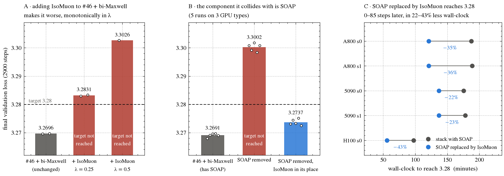
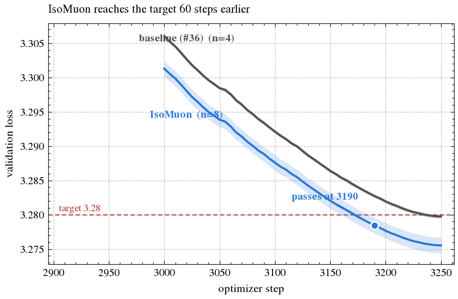
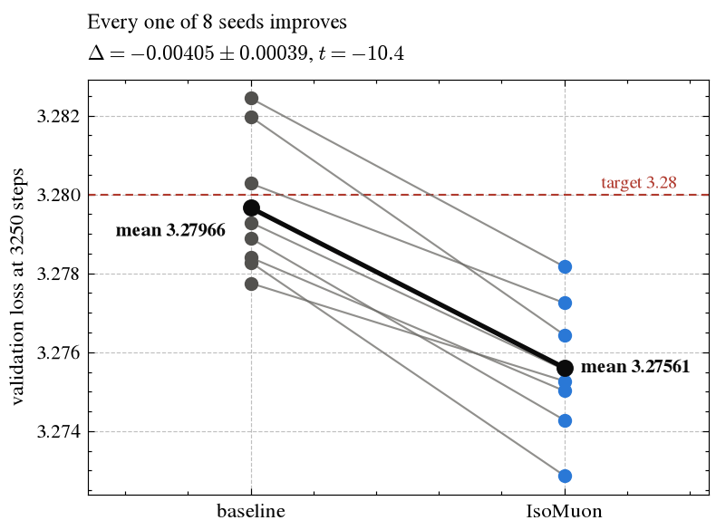
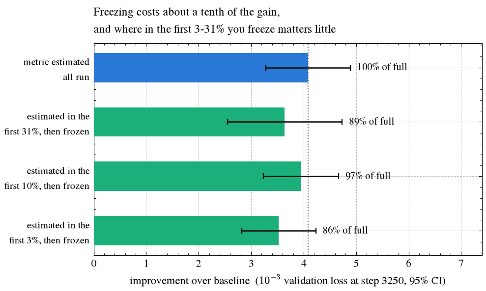
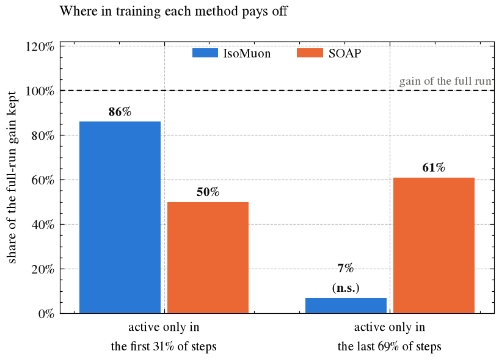
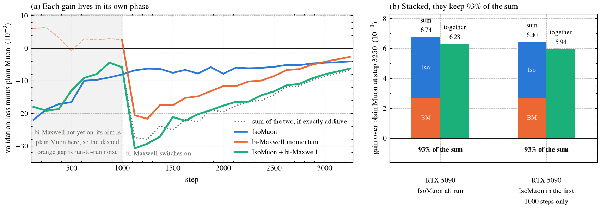

# Track 3: IsoMuon — Muon with an isothermal polar decomposition, and the metric can be fixed early -- 3.28 in 3190 steps (n=8)

## TL;DR
IsoMuon takes Muon's Newton–Schulz polar decomposition in a diagonal metric set by the **gradient's own sampling-noise variance**, so that every output row and input column of a hidden matrix receives a step at the same noise level. It adds two vector EMAs per matrix and negligible compute; its two constants (λ = 0.5, c = 2) were chosen in a few single-seed runs during development (see the ablations) and were not tuned on this benchmark. On the tuned Muon + aux AdamW baseline (result #36, 3250 steps) it reaches 3.28 at **3190 steps** (mean 3.27842, n=8 non-cherry-picked seeds 0–7, `(3.28 − mean)·√8 = 0.00446 ≥ 0.004`).

## What is new
Muon's orthogonalization makes every singular direction of the update move at unit speed. It does not ask *which coordinates are noisy*. In a language model the gradient of a hidden matrix is dominated by label-sampling noise, and its variance is strongly non-uniform across output channels (rows) and input channels (columns). IsoMuon measures that variance for free — from the micro-batch gradients that every step already computes — and whitens the momentum update by a diagonal metric: each channel's relative noise raised to the power λ and clipped to [1/c, c],

    B = clamp((row_heat / mean)^λ, 1/c, c),  A = clamp((col_heat / mean)^λ, 1/c, c),  λ = 0.5, c = 2
    D = B^-1/2 · polar(B^-1/2 U A^-1/2) · A^-1/2,   ‖D‖_F re-aligned to ‖polar(U)‖_F

where `row_heat`/`col_heat` are EMAs (β = 0.95) of the row/column means of `Var_k[g_k]` over the micro-batches `k` of the step. λ = 0 is exactly Muon. Put physically, the sampling noise acts like a temperature that differs from channel to channel, and IsoMuon takes the orthogonalized step as if every channel were at the same temperature, which is where the name comes from.

The estimator does not depend on the number of GPUs: the per-micro-batch squared-gradient row/column sums are all-reduced together with the gradient, so 1, 2, 4 or 8 GPUs give the same expected noise estimates.

## Origin: the endpoint-metric polar decomposition (EMP)

IsoMuon grew out of an earlier experiment of ours that was never submitted on its own, so we describe it here.
It was run on an older setup: a Muon trainer derived from the track-3 baseline script `train_gpt_simple.py`, run for 3500 steps on one A800 per run.

Muon's polar decomposition fixes the singular directions of the momentum. We had first tried rescaling the orthogonalized update channel by channel, using several per-channel statistics, and none of these moved the final loss: they change step
sizes but leave the directions, and so the trajectory, where they were. EMP instead changes the metric in which
the polar decomposition is taken:

    Y = B^-1/2 · M · A^-1/2,   D = B^-1/2 · polar(Y) · A^-1/2,   D re-aligned to the RMS of Muon's update
    A, B = clamp(exp(λ·(log h − mean log h)), 0.5, 2)

Here `h` is an EMA of the momentum's column energy for `A` and of its row energy for `B`. Because a weight gradient
is an outer product of the output gradient and the input, its column energy tracks the input second moment and its
row energy the output-gradient second moment, up to a common factor that the mean-log normalisation removes. So the
metric needs no extra hooks. λ = 0 is exactly Muon.

| EMP strength λ | Δ final loss vs Muon (3 paired seeds) | seeds improved |
|---|---|---|
| 0.125 | −0.00190 | 3 of 3 |
| **0.25** | **−0.00206** | **3 of 3** |
| 0.375 | −0.00213 | 3 of 3 |

Same-seed run-to-run noise on that setup was about ±0.0005. At λ = 0.25, two of the three seeds crossed 3.28 25
steps earlier, and the mean wall-clock to the target was unchanged. The effect carried over to H200 (two seeds:
−0.00096 and −0.00490, the second crossing 50 steps earlier). Adding a rank-2 off-diagonal term to the diagonal metric gave nothing further (−0.00024, within noise).

IsoMuon keeps EMP's structure and changes only the statistic `h`: the gradient's sampling-noise variance instead of the
momentum's energy. On the #36 baseline the momentum-energy statistic recovers about half of IsoMuon's gain (−0.0021 and
−0.0019 on two seeds, against −0.0038 to −0.0041 for IsoMuon in the same set of runs). The sampling-noise variance is the better-founded choice, because it is what the metric is supposed to equalize.

## IsoMuon stacked on the current SOTA

The first thing we tried was the obvious one: add IsoMuon to the strongest stack we had, the current record #46 (2690 steps) with the bi-Maxwell momentum of our PR #339 on top (2655 steps on A800, 2635 on H100). It made the stack
**clearly worse, monotonically in λ**: at λ = 0.25 the final loss rises by 0.014 and the run no longer reaches 3.28
within 2900 steps; at λ = 0.5, +0.033. Two seeds on RTX 5090 and one on A800 agree.

A gain that vanishes — or reverses — when added on top is the signature of a component drawing on the same improvement as something already in the stack: the two are not additive because they are taking a share of the
same thing. That turns the result into a question: *which component?*

Ablating the stack answers it. Removing SOAP alone costs the target entirely — no run reaches 3.28. Putting
IsoMuon into the place SOAP vacated brings it back: the final loss is only 0.004–0.005 above the unchanged stack and 3.28 is first reached within 0–85 steps of it, consistently across 5 runs on three GPU types (A800, RTX 5090, H100). No other component
we removed behaved this way.



So the two draw on the same information, and the usable form is a **replacement, not an addition**: with SOAP swapped out for IsoMuon, 3.28 is first reached 0–85 steps later (2700–2725, against 2625–2700 for the full stack on the same GPU type) for **22–43 %
less wall-clock**.

One further check on what that shared information is. We tried the full-matrix version of the isothermal metric
— the row- and column-side noise covariance matrices with bounded eigenvalues, so that channels may also rotate
into each other: it costs 1.85× the wall-clock and brings no additional gain (same result within seed noise).
The usable part of the noise covariance is its diagonal, the channel scales; the off-diagonal channel
correlations add nothing. That is why IsoMuon keeps only the diagonal and costs nothing — and it is a first hint
at why SOAP, which also carries an eigenbasis, is not simply replaceable in general (see section 3 of the update).

## Algorithm (the entire change to `train_gpt_simple.py`)
```python
# per step, inside the micro-batch loop (hidden matrices only):
gk = p.grad - prev            # this micro-batch's gradient
rs2 += gk.square().sum(1); cs2 += gk.square().sum(0)
# after all-reduce of the gradient and of rs2/cs2:
row_heat = rs2/K/n - (g/K).square().sum(1)/n     # Var_k[g_k] averaged over columns
col_heat = cs2/K/m - (g/K).square().sum(0)/m     # ... over rows
state.row_heat.lerp_(row_heat, 0.05); state.col_heat.lerp_(col_heat, 0.05)
# update:
bi = clamp((row_heat/row_heat.mean())**0.5, 0.5, 2).rsqrt()[:, None]
ai = clamp((col_heat/col_heat.mean())**0.5, 0.5, 2).rsqrt()[None, :]
P = newton_schulz((u * bi) * ai)
D = (P * bi) * ai;  D *= sqrt(min(m, n)) / D.norm();  D *= max(1, m/n)**0.5
```

## Results



| run | seeds | mean val loss | `(3.28 − mean)·√n` |
|---|---|---|---|
| IsoMuon | 0–7 | 3.27842 @ 3190 | 0.00446 ✓ |
| baseline (#36 script, same GPUs) | 0–3 | 3.27973 @ 3250 | – |

Per-seed first crossing of 3.28 (validation every 5 steps from step 3000; the reported step is the earliest common step that passes the test): 3170, 3175, 3165, 3190, 3150, 3175, 3190, 3175 (val at 3250: 3.27517, 3.27580, 3.27483, 3.27679, 3.27342, 3.27541, 3.27707, 3.27569; mean 3.27552, sd 0.00114).
Pairwise vs #36 (n=10, 3.2787 @ 3250) with the step adjustment defined in the track-3 README: `(3.2787 − 3.27842 + 60/100·0.0045) / √(1/8 + 1/10) = 0.00628 ≥ 0.004` (statsig); at equal step count 3250, `(3.2787 − 3.27552) / √(1/8 + 1/10) = 0.00670` (statsig). Same-GPU baseline (the same file with `--isomuon 0`, seeds 0–3): 3.27975, 3.27933, 3.27980, 3.28005 at 3250 (mean 3.27973), i.e. IsoMuon is 0.0042 lower at the same step on the same GPUs, and every IsoMuon seed ends below every baseline seed.

Ablations (single-GPU runs of the #36 setup, seed-paired): λ = 0.25 / 0.5 / 1.0: −40 / −50 / worse than baseline; row-only or column-only metric: about half the gain; momentum energy instead of noise variance (EMP): about half; activation and output-gradient second moments instead of noise variance: about the same; bounded full-matrix metric: same at 1.85× time.

## Reproduce
```bash
torchrun --standalone --nproc_per_node=$(nvidia-smi -L | wc -l) \
  records/track_3_optimization/results/20260919_isomuon_3190/train_gpt_isomuon.py --seed 0 --isomuon 1
```
`--isomuon 0` runs the unmodified #36 baseline from the same file. Logs `isomuon_seed{0..7}.txt` (and `baseline_seed{0..3}.txt` for `--isomuon 0`) embed the full source; runs used one RTX 5090 each (`--mbs 64`, the summed gradient is identical for any micro-batch size that divides the batch). The freezing runs of section 2 of the update use `freeze/train_gpt_isomuon_freeze.py`, which is this file plus a three-line `--freeze F` flag that stops updating the per-channel noise estimates after step `F`; with `--freeze 0` it runs exactly the submitted code. Their logs are in `freeze/`.

## Update (2026-09-22): further experiments

The sections below were added after the n=8 result above. All of them use the full 3250-step benchmark except the comparison with SOAP in section 3, which is marked.

### 1. The gain reproduces in an independent implementation (n=8 paired)

The same isothermal metric, implemented from scratch in a separate single-GPU trainer
derived from a different baseline script, reproduces the effect at full strength:

| | mean @ 3250 | seed sd | `(3.28 − mean)·√8` |
|---|---|---|---|
| baseline | 3.27966 | 0.00175 | 0.00095 |
| IsoMuon (λ = 0.5) | **3.27561** | 0.00168 | **0.01242** |



Paired over seeds 0–7: **Δ = −0.00405 ± 0.00039 (t = −10.4), 8 of 8 seeds improved.**
On this script the baseline does not pass the target at 3250 steps and IsoMuon passes it
with 3× margin. Note how large the seed spread is relative to the effect (baseline range
3.27775–3.28244): single-seed comparisons cannot resolve effects of this size.

### 2. The metric only has to be *estimated* in the first few percent — IsoMuon simplifies

Freeze the per-row and per-column noise estimates after step *f* and keep the metric fixed for the rest of training. We ran this
on the submitted file with a three-line `--freeze` flag added (`freeze/train_gpt_isomuon_freeze.py`, logs alongside it) — `--freeze 1000`, `--freeze 325` and `--freeze 100`, the first 31%, 10% and 3% of
the 3250 steps — with seeds 0–3 at each point, paired against same-seed runs of the baseline and of IsoMuon as submitted.



| variant | Δ vs baseline | share of full gain | first step passing (n=4 test) | Δ vs IsoMuon as submitted |
|---|---|---|---|---|
| baseline (`--isomuon 0`) | — | — | never inside 3250 | — |
| **metric estimated all run** | **−0.00408 ± 0.00041** | **100%** | **3200** | — |
| estimated in the first 31%, then frozen | −0.00364 ± 0.00056 | 89% | 3210 | +0.00044 |
| estimated in the first 10%, then frozen | −0.00395 ± 0.00036 | 97% | 3200 | +0.00013 |
| estimated in the first 3%, then frozen | −0.00353 ± 0.00036 | 86% | 3210 | +0.00056 |

Two results, one of them not what we expected.

**Freezing is not free.** Pooled over the three freezing points, the frozen metric ends +0.00038 ± 0.00015 above IsoMuon as submitted (t = +2.6), about a tenth of the gain. In steps that is the difference between passing
the significance test at 3200 and passing it at 3210.

**Where you freeze matters little.** The three points span 0.0004 with no monotonic order: the latest point, 31%,
is no better than the earliest, 3% (t = −0.4), and no better than 10% (t = +1.2). The one pairwise difference that
is significant at n=4, 10% against 3% (t = −5.0), is not part of a trend, so we read the curve as flat. Freezing
the metric after *step 100* — three percent of training — keeps 86% of the gain and still passes
the target inside 3250 steps. The per-channel noise estimates are essentially settled in the first hundred steps and stop
carrying new information after that.

This separates two things the original formulation conflated. *Estimating* the metric matters only at the very
start. *Applying* it matters for the whole run. On the independent implementation of section 1 (seed 0), estimating the metric over the first 1000 steps and applying it frozen for the rest keeps
93% of the gain. Applying it only in the first 1000 steps and then reverting to plain Muon keeps 70%. Applying it
only after step 1000 keeps nothing (+0.00027). IsoMuon is therefore better stated as

> a polar decomposition in a **fixed** diagonal channel metric, estimated from the sampling noise during the
> first few percent of training,

which removes the per-step micro-batch noise statistics — and the micro-batch split they require — from
essentially the whole run, at a cost of about ten steps. The headline 3190 steps above is IsoMuon as submitted; the frozen metric is offered as a simplification, not as the record. The first-passing steps in the
table use the n=4 form of the test, which is stricter than the n=8 test behind the headline, so IsoMuon as submitted shows 3200 here rather than 3190.

### 3. IsoMuon's gain comes early in training; SOAP's does not



Restricting each method to part of training, on a smaller, shorter setup used for fast comparisons (512-d, 8 layers, 262k-token batch,
1200 steps), n=4 paired:

| active window | IsoMuon | SOAP |
|---|---|---|
| first 31% of steps only | **86%** of its full-run gain | 50% |
| last 69% of steps only | 7% (not significant, t = 0.42) | 61% |

SOAP's two shares add to 112%: its gain is spread roughly uniformly over the run, in proportion to the number
of steps it is on. IsoMuon's is concentrated early, and the benchmark agrees: restricted to the first
1000 of 3250 steps it keeps 70% of the gain, and restricted to the last 2250 it keeps none (+0.00027, seed 0).

Both methods reshape the geometry of the update, so the difference is informative: **when a method pays off follows how fast the statistic it corrects keeps changing.** Channel scales settle early and then stop moving — which is exactly why
the frozen metric in section 2 works. SOAP's eigenbasis keeps rotating, so it has to keep being re-estimated
and keeps paying off.

### 4. IsoMuon together with bi-Maxwell momentum

bi-Maxwell momentum is the two-timescale momentum of our PR #339: two momentum EMAs with fixed rates, mixed with a fixed weight. In the runs below it switches on at step 1000.



RTX 5090, seed 0, 3250 steps, plain Muon; each comparison is paired only with the plain-Muon run from its own batch of runs.

| comparison | bi-Maxwell alone | IsoMuon alone | sum | together | share of the sum |
|---|---|---|---|---|---|
| IsoMuon all run | −0.00267 | −0.00407 | −0.00674 | −0.00628 | **93%** |
| IsoMuon only in the first 1000 steps | −0.00269 | −0.00371 | −0.00640 | −0.00594 | **93%** |

Panel (a) shows why they barely interfere. IsoMuon's lead is largest in the first 1000 steps. bi-Maxwell only
switches on at step 1000, and from then on the combined curve tracks the sum of the two. IsoMuon applied only
*after* step 1000 gives nothing at the end (+0.00027). The two act in different stages of training, so they add up because they are separated in time, rather than two corrections competing for the same steps. These are
single-seed runs, so 93% should be read as "close to additive", not as a measured constant.
